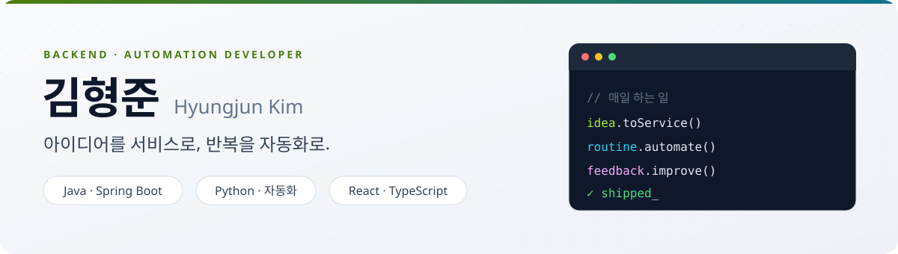
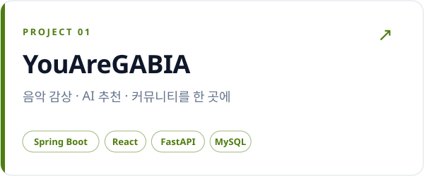
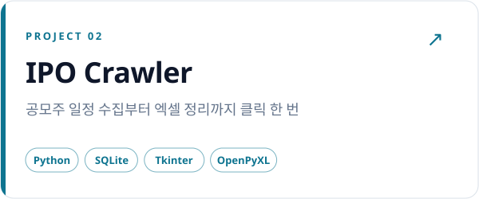

<picture>
  <source media="(prefers-color-scheme: dark)" srcset="./assets/hero-dark.svg">
  
</picture>

  
  
  

 

## 👋 About

**Java · Spring 백엔드**와 **Python 자동화**를 주로 다루는 개발자 김형준입니다.

- 🧩 흩어진 기능을 **하나의 흐름으로 잇는 서비스**를 만듭니다
- ⚙️ 사람이 반복하는 일은 **클릭 한 번으로 끝나는 도구**로 바꿉니다
- 🔁 실제 사용자의 피드백으로 **계속 고쳐 나가는 것**을 좋아합니다

 

## 🛠 Tech Stack

| | |
| :-- | :-- |
| **Backend** |      |
| **Frontend** |      |
| **AI · Automation** |     |
| **Tools** |     |

 

## 🚀 Featured Projects

<table>
<tr>
<td width="50%" valign="top">

<a href="https://github.com/jun960303/portfolio">
<picture>
  <source media="(prefers-color-scheme: dark)" srcset="./assets/card-music-dark.svg">
  
</picture>
</a>

**🎵 음악 스트리밍 · 커뮤니티 플랫폼**
2026.01 – 04 · 4인 팀 프로젝트

유튜브·커뮤니티·퀴즈 앱으로 흩어진 음악 활동을 한 플랫폼으로 묶었습니다.

- **AI 음악 추천** — FAISS 유사도 + Last.fm 하이브리드
- **AI 챗봇** — GPT 추천 결과를 iTunes API로 검증
- **공동 플레이리스트** — 곡 제안 · 투표 · 자동 선정

[소개](https://github.com/jun960303/portfolio) · [백엔드 코드](https://github.com/jun960303/youaregabia_backend) · [라이브 데모](http://gapmusic.duckdns.org)

</td>
<td width="50%" valign="top">

<a href="https://github.com/jun960303/ipo-crawler">
<picture>
  <source media="(prefers-color-scheme: dark)" srcset="./assets/card-ipo-dark.svg">
  
</picture>
</a>

**📈 공모주 자동 수집 데스크톱 도구**
개인 프로젝트 · 가족이 실제로 쓰는 도구

매번 사이트를 돌며 확인하던 공모주 일정을 버튼 하나로 모아 줍니다.

- **자동 수집** — 청약일 · 수요예측 · 상장일 크롤링
- **중복 없는 저장** — 새 일정만 SQLite에 누적
- **엑셀 내보내기** — 서식까지 맞춘 파일을 바탕화면에

[소개 및 코드](https://github.com/jun960303/ipo-crawler)

</td>
</tr>
</table>

 

  작은 불편을 발견하고, 직접 만들고, 계속 개선합니다. 
  <b>© 김형준 · jun960303</b>

