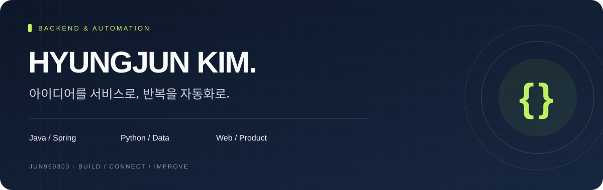
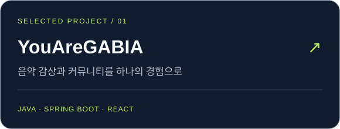
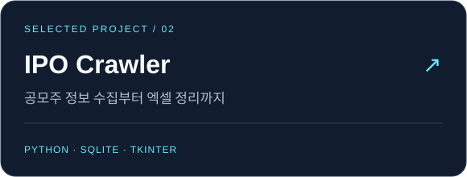

  

  <a href="https://jun960303.github.io/portfolio"><b>포트폴리오 ↗</b></a>
  &nbsp;&nbsp; / &nbsp;&nbsp;
  <a href="https://github.com/jun960303?tab=repositories"><b>전체 프로젝트 ↗</b></a>
  &nbsp;&nbsp; / &nbsp;&nbsp;
  <a href="#selected-projects"><b>대표 프로젝트 ↓</b></a>

 

### 안녕하세요, 김형준입니다.

**Java·Spring 기반 웹 개발과 Python 자동화 도구를 만들고 있습니다.**  
사용자가 여러 화면과 반복 작업을 오가는 불편을 줄이고, 필요한 기능이 하나의 흐름으로 이어지는 서비스를 지향합니다.

| SERVICE | AUTOMATION | EXPERIENCE |
| :--- | :--- | :--- |
| 웹 서비스와 백엔드 개발 | 데이터 수집·정리·내보내기 | 사용하기 쉬운 화면과 작업 흐름 |
| Java · Spring · MySQL | Python · SQLite | React · TypeScript |

 

<h2 id="selected-projects">Selected Projects</h2>

<table>
<tr>
<td width="50%" valign="top">

**음악 스트리밍 · 커뮤니티 플랫폼**

음악 감상, 추천, 플레이리스트와 커뮤니티를 연결한 팀 프로젝트입니다. 포트폴리오에서 서비스 구성과 구현 내용을 확인할 수 있습니다.

[프로젝트 소개 →](https://github.com/jun960303/portfolio) · [백엔드 코드 →](https://github.com/jun960303/youaregabia_backend)

</td>
<td width="50%" valign="top">

**공모주 정보 수집 · 조회 · 엑셀 출력**

반복적인 정보 확인을 줄이기 위한 데스크톱 도구입니다. 수집한 일정을 저장하고, 화면 조회와 엑셀 내보내기로 이어집니다.

[프로젝트 소개 및 코드 →](https://github.com/jun960303/ipo-crawler)

</td>
</tr>
</table>

 

## Tools & Technologies

프로젝트에서 사용하며 경험을 쌓고 있는 기술입니다.

| 영역 | 기술 |
| :--- | :--- |
| **Backend** | Java · Spring / Spring Boot · JPA |
| **Frontend** | React · TypeScript · JavaScript · HTML / CSS |
| **Data & Automation** | Python · MySQL · SQLite · 웹 데이터 수집 |
| **Development** | Git · GitHub · IntelliJ IDEA · VS Code |

 

## Build Notes

- **반복을 줄이는 도구** — 수집, 중복 확인, 저장, 내보내기를 연결합니다.
- **흐름이 이어지는 서비스** — 기능 하나보다 사용자가 목적을 달성하는 과정을 고민합니다.
- **계속 다듬는 구현** — 실제 사용 중 발견한 불편을 다음 개선으로 이어갑니다.

 

---

  작은 불편을 발견하고, 직접 만들고, 계속 개선합니다. 
  <b>김형준 · jun960303</b>

